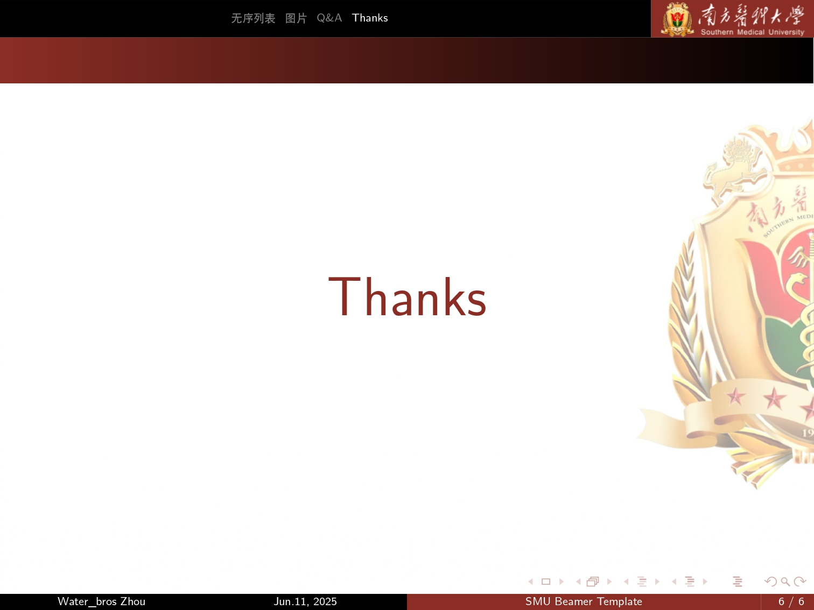

# 南方医科大学Beamer模板

## 参考
- [华南师范大学Beamer模板](https://github.com/Elitedj/SCNU_BeamerTemplate)
- 将学校logo和配色修改为南方医科大学(主题色#8C2E25和logo均来自[南方医科大学官网](https://www.smu.edu.cn/))
- 在此基础上稍作微调

## 使用方法
在[Overleaf](https://www.overleaf.com/)上新建文档，将本模板所有文件导入，根据所需修改内容即可。

## 效果

